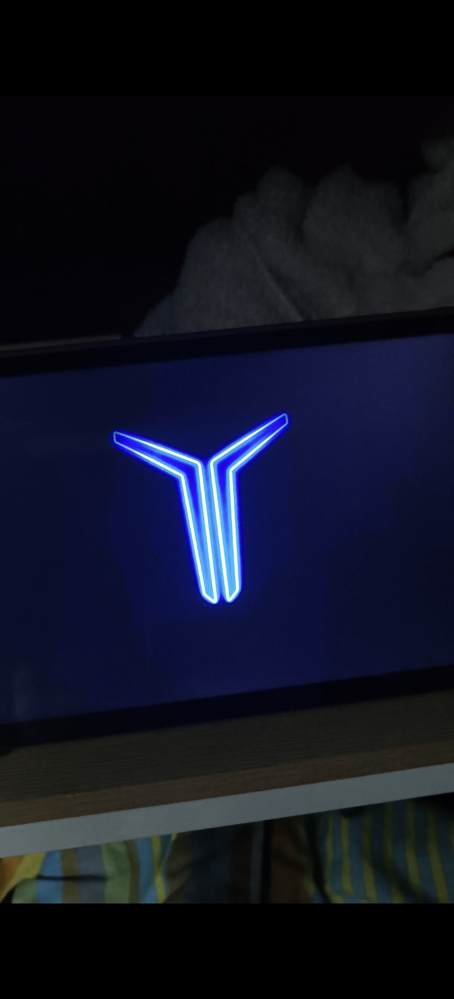
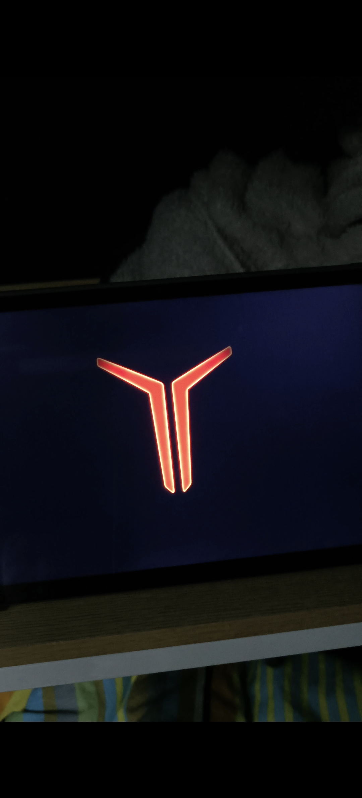
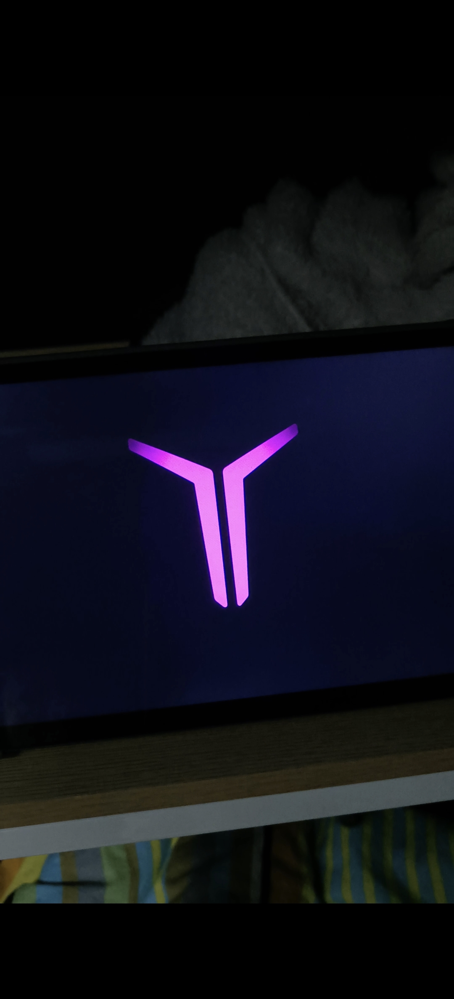
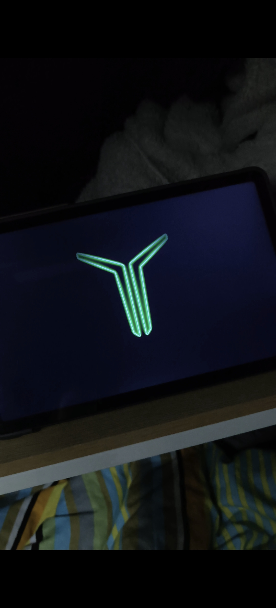
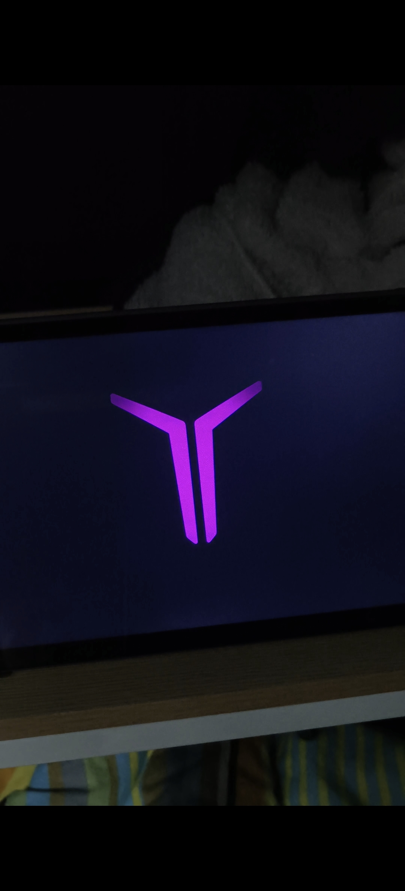
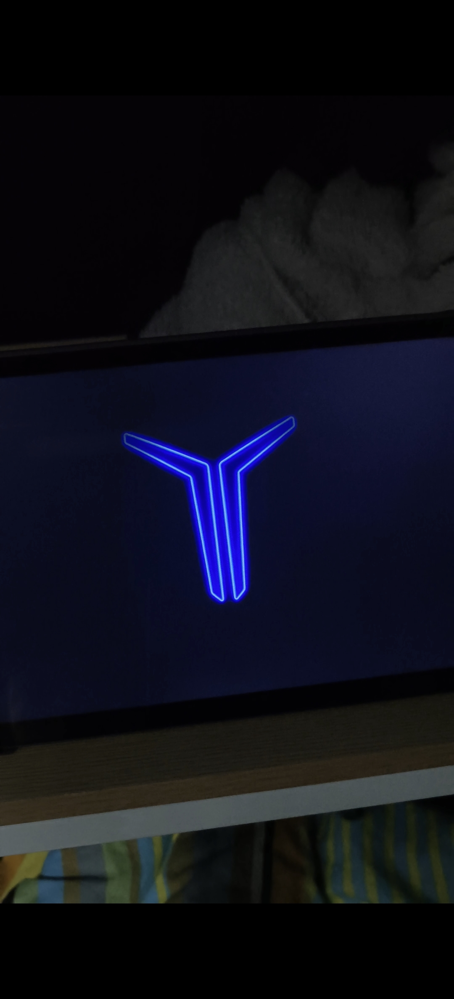

# Legion-AOD-Simulator 拯救者息屏模拟器 🚀

这是一款专为安卓平板（特别是联想拯救者系列）设计的“模拟息屏显示”工具。通过 Web 技术与 Python 服务器结合，在你的平板上实现极其丝滑、无边框、无水印的七彩 RGB 呼吸灯特效。

---

### 📸 实景拍摄 (Real-world Showcase)

以下是本项目在拯救者平板上的真实运行效果展示：

| 蓝色呼吸模式 | 紫色呼吸模式 | 红色呼吸模式 |
| :---: | :---: | :---: |
|  |  |  |
|  |  |  |

---

### ✨ 功能亮点

- **RGB 序列呼吸**：按照红、橙、黄、绿、蓝、紫序列，实心与边缘发光效果交替呼吸。
- **沉浸式全屏**：点击屏幕即刻触发全屏，自动隐藏浏览器地址栏、系统状态栏和导航键。
- **极致去水印**：内置 CSS 裁切算法，完美去除 AI 生成图片自带的水印。
- **防烧屏保护**：Logo 呼吸时伴随微小像素位移，有效保护 OLED/LCD 屏幕。

---

### 🛠️ 操作过程（新手五分钟上手）

#### 1. 准备环境
- 在平板上安装 **Termux**。
- 确保你的图片（1.png - 14.png）和 `index.html` 放在同一个文件夹（例如 `Download/LegionAOD`）。

#### 2. 启动服务
打开 Termux，输入以下两条命令：
```bash
# 进入存放代码的文件夹
cd /sdcard/Download/LegionAOD

# 开启 Python 微型服务器
python -m http.server 8080
